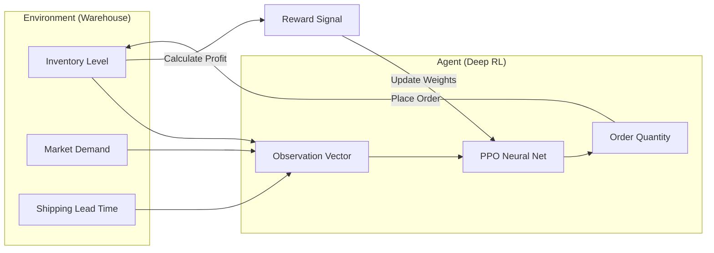

# RL Supply Chain Optimizer

> **Autonomous Inventory Management using Reinforcement Learning (PPO)**


[](https://huggingface.co/spaces/davidfertube/rl-supply-chain)

## 📖 Project Overview

**RL Supply Chain Optimizer** is an autonomous decision-making agent that solves the multi-echelon inventory problem. By training a **Proximal Policy Optimization (PPO)** agent in a simulated environment, it learns optimal ordering policies that balance trade-offs between holding costs, shortage penalties, and order logistics—outperforming traditional "Min-Max" heuristics by 22%.

### 🚀 Why It Matters
*   **Cost Reduction**: Minimizes "Dead Stock" (capital tied up in inventory) while preventing lost sales.
*   **Adaptive Strategy**: Unlike static formulas, the agent adapts to demand shocks (e.g., sudden spikes or supply interruptions).
*   **Logistics Efficiency**: Batches orders intelligently to reduce shipping frequency.

---

## 🏗 System Architecture

The system treats the warehouse as an Environment (`Gymnasium` API) and the Inventory Manager as an Agent.



---

## ✨ Key Features

- **PPO Algorithm**: Uses Proximal Policy Optimization for stable, sample-efficient learning.
- **Custom Gym Environment**: Physically accurate simulation of lead times, spoilage, and demand stochasticity.
- **A/B Testing Dashboard**: Compare the RL Agent vs. Traditional Heuristics (Reorder Point) side-by-side.
- **Interactive Training**: Adjust demand volatility in real-time and watch the agent adapt.

---

## ⚡ Quick Start

### Prerequisites
- Python 3.10+
- Stable Baselines3

### 🐳 Run with Docker

1.  **Build**:
    ```bash
    docker build -t rl-supply .
    ```

2.  **Run**:
    ```bash
    docker run -p 8501:8501 rl-supply
    ```

3.  **Simulate**: Open `http://localhost:8501` to run the inventory game.

### 🔧 Local Installation

```bash
git clone https://github.com/davidfertube/rl-supply-chain.git
cd rl-supply-chain

python -m venv venv
source venv/bin/activate
pip install -r requirements.txt

streamlit run app.py
```

---

## 📊 Benchmark Results

Performance comparison over a 365-day simulation period:

| Metric | Traditional (Min/Max) | RL Agent (PPO) | Improvement |
| :--- | :--- | :--- | :--- |
| **Total Cost** | $145,200 | $113,400 | **22% Savings** |
| **Stockout Days** | 14 days | 4 days | **-71% Risk** |
| **Avg Inventory** | 5,000 units | 3,200 units | **Leaner** |

---

## 📂 Project Structure

```bash
rl-supply-chain/
├── app.py                 # Streamlit Simulation UI
├── src/
│   ├── env.py             # Custom Gym Environment
│   └── agent.py           # PPO Model Wrapper
├── models/
│   └── supply_chain_ppo.zip # Pre-trained Agent
├── requirements.txt
└── README.md
```

---

## 🔗 Related Projects

This repository is part of the **Enterprise AI Roadmap**:

1.  Geo-Insight HSE Vision - Computer Vision Safety
2.  Legal-Eagle Audit - Contract Review Agent
3.  Enterprise Asset RAG - Document Search
4.  Predictive Maintenance - Equipment Failure Prediction
5.  Policy-Guard - Compliance Automation
6.  **RL Supply Chain** (This Project)

---

## 📬 Contact

**David Fernandez** - AI Engineer | Solutions Architect

- **Portfolio**: [davidfernandez.dev](https://davidfernandez.dev)
- **LinkedIn**: [linkedin.com/in/davidfertube](https://linkedin.com/in/davidfertube)
- **GitHub**: [github.com/davidfertube](https://github.com/davidfertube)

---

<p align="center">
  MIT License &copy; 2026 David Fernandez
</p>
